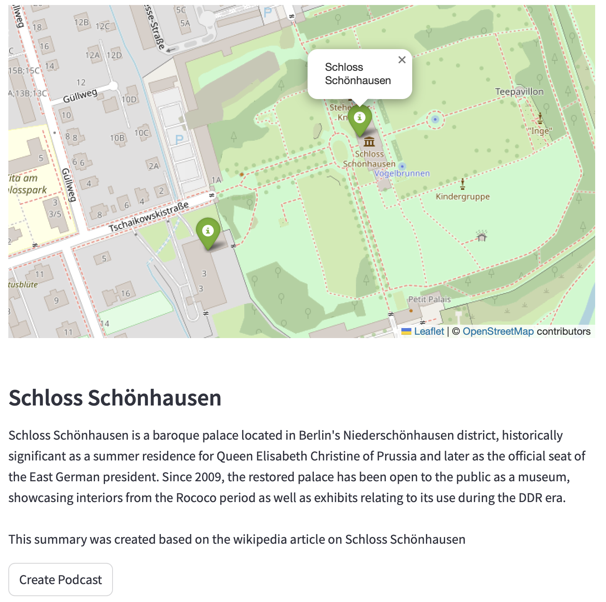

# tellme

> Rediscover your city - one podcasts at a time.

----

tellme lets you effortlessly discover your surroundings by turning Wikipedia articles of attractions close to your location into engaging podcasts.




> Warning: All podcasts are AI generated and can/will be inaccurate.

tellme is heavily inspired by [podcastfy](https://github.com/souzatharsis/podcastfy) and builds on many great packages, such as [chatlas](https://posit-dev.github.io/chatlas/), [streamlit](https://streamlit.io), and [geopy](https://geopy.readthedocs.io/en/stable/).

## Using tellme

There are different ways to set up tellme. Because tellme uses LLMs to create the podcasts, your will need API keys for those. There are currently two supported setups:

1. Free with Gemini: Google provides a free API key for it's LLM Gemini. To create an API key, got to https://aistudio.google.com/apikey. When using Gemini, the podcast voices are created with edge tts, which is also free to use.
2. Non-free OpenAI: When using OpenAI, both the podcast script and the voices are created with OpenAI. Generally, the voices are a bit better than those of edge tts. To use OpenAI, you will have to generate an API key: https://help.openai.com/en/articles/4936850-where-do-i-find-my-openai-api-key

## Using docker to run the app

If you are only interested in running tellme and exploring your surroundings, you can do so with docker. First, download and install docker. 

When on linux or windows, run:

```
docker run -p 8501:8501 ghcr.io/jhorzek/tellme:latest
```

On mac-os run:

```
docker run --platform linux/amd64 -p 8501:8501 ghcr.io/jhorzek/tellme:latest
```

Go to the browser window indicated in the terminal and start exploring.

## Contributing to tellme

The easiest way to work with the source code of tellme is to use Github's codespaces. Simply click on the "Code" button on top, select codespaces and click open in codespace. The setup may take a minute, but after that you should have the projects latest version in an online VSCode interface ready to go. To create a podcast, run

```
poetry run streamlit run --server.port=8501 --server.address=0.0.0.0 tellme/User_interface/streamlit_UI.py
```

If you want to develop locally, please:

1. install Docker on your computer
2. install VSCode and the Dev Containers extension
3. Download the project. The Dev Containers extension should automatically detect the docker setup and ask you if it should set up the dev container for you

After a few minutes, you should be ready to code! You can run the application with

```
poetry run streamlit run --server.port=8501 --server.address=0.0.0.0 tellme/User_interface/streamlit_UI.py
```
